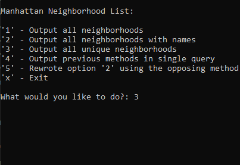
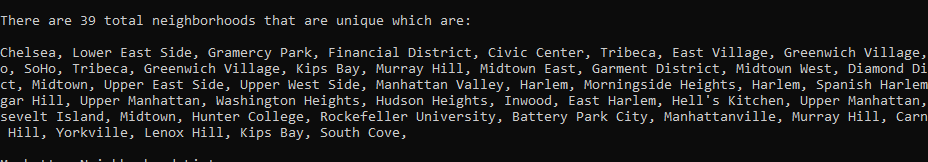

# Console Application

## LINQ-in-Manhattan

Lab09-LINQ-Queries

*Author: Joseph Hangarter*

----

## Description

* This is a C# console appilcation program that brings in data from an external file, reads the data, and filters the data based on specified values.
* The user is given options on which query to pick (visual shown below for options).
---

### Getting Started
Clone this repository to your local machine.

```
$ git clone [https://github.com/JCode1986/LINQ-in-Manhattan.git]
```

### To run the program from Visual Studio:
Select ```File``` -> ```Open``` -> ```Project/Solution```

Next navigate to the location you cloned the Repository.

Double click on the ```LinqInManhattan``` directory.

Then select and open ```LinqInManhattan.sln```

---

### Visuals

#### Application Start

#### Using the Application


------------------------------